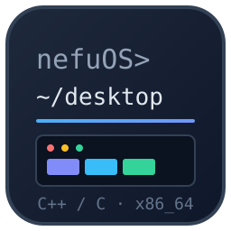
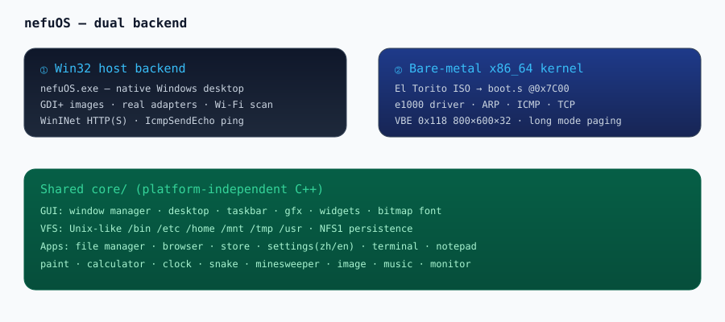

# nefuOS



A tiny hobby operating system written in C++/C with **two backends**:

1. **Win32 host** — runs as a native Windows desktop app (`dist\nefuOS.exe`)
2. **Bare-metal x86_64 kernel** — boots from an El Torito ISO in QEMU / VirtualBox / real hardware

Everything is real: the GUI, the Unix-like VFS, the networking stack, and the apps.



---

## Features

### Desktop & GUI
- Window manager with draggable/resizable windows, taskbar, focus handling
- Desktop icons are **shortcuts**: deleting a shortcut never deletes the original app
- Draggable desktop icons with grid snap (no accidental overlaps)
- Trash (deleting files moves them to `/home/user/Trash`)
- Chinese / English language switch (Settings app)

### Apps (all built-in, all functional)
| App | Notes |
|---|---|
| File Manager | dual-pane, tree + list, sort, icon/list view, open `.ppm`/`.bin`/`.nefud`/text |
| Browser | real minimal TCP, address bar input fixed, page save to `/usr/downloads` |
| Network Settings | **real adapter info** (MAC/IP/gateway), **real Wi-Fi scan** on host (Wlan API), real ICMP ping, bare-metal wired link |
| Settings | zh/en language switch, desktop info |
| Store | scrollable catalog, 8+ installable apps, keyboard PgDn |
| Image Viewer | `.ppm` viewer; host backend decodes jpg/png/gif/bmp via GDI+ |
| Music Player | note sequencer (beeps) |
| System Monitor | CPU/memory stats |
| Terminal | Linux-style commands, see below |
| Notepad / Paint / Calculator / Clock / Snake / Minesweeper | classic built-ins |

### Networking (real, not simulated)
- Bare metal: Intel e1000 NIC driver + ARP + ICMP ping + minimal TCP
- Verified: inside QEMU the OS connected to a real HTTP server and received
  `HTTP/1.0 200 OK` (205 bytes) — full ARP → IP → ICMP → TCP → HTTP chain
- Host backend: reads the **real** adapter (GetAdaptersInfo) and performs a
  **real Wi-Fi scan** (WlanGetAvailableNetworkList) — real SSIDs, signal
  quality, encryption state; ping uses real ICMP (IcmpSendEcho)

### Unix-like file system (real files & directories)
```
/          root
/bin       built-in binaries
/etc       configuration (store.conf)
/home/user Documents, Pictures, Music, Downloads, Trash
/mnt       mounts
/tmp       temporary files (OS scratch here)
/usr       user programs & downloads (browser saves to /usr/downloads)
```
- Files are stored in a real VFS, serialized with the `NFS1` magic and saved
  to `nefuos.fs` on the host backend
- `echo > file` redirection, real `mkdir`/`touch`/`rm`/`cat`, cleanup of stray nodes

### Terminal commands (Linux-style)
`help` `ls` `cd` `pwd` `cat` `mkdir` `touch` `rm` `echo` `clear` `tree` `about`
`uptime` `exit` `shutdown` `reboot` `poweroff`

### Unix-style apps
- `.nefud` and `.bin` files open directly from the File Manager
- `.bin` gets a distinct icon (dark box with `>_`)
- System apps come preinstalled (11 entries in the store catalog)

---

## Architecture

```
nefuOS/
├── core/                  # platform-independent OS core
│   ├── apps/              # every application
│   ├── gui/               # gfx, window manager, widgets, desktop, fonts
│   ├── klib/              # kernel libc (printf, string, memory)
│   ├── net/               # e1000 driver + ARP + ICMP + TCP
│   ├── sys/               # settings (zh/en), language strings
│   └── vfs/               # Unix-like virtual file system
├── backends/
│   ├── win32/win32.cpp    # Windows host: window, GDI+, real adapters
│   └── bare/              # x86_64: boot.s, entry.s, kernel main, e1000
├── tools/
│   ├── build_iso.ps1      # one-command build (host exe + kernel + ISO)
│   └── make_iso.py        # El Torito no-emulation ISO builder
└── dist/
    ├── nefuOS.exe         # host backend (Windows)
    └── nefuOS_v2.iso      # bootable ISO (bare-metal backend)
```

### Boot chain (El Torito no-emulation)
```
BIOS/SeaBIOS ──boot catalog──▶ 2 KiB boot image @0x7C00 (boot.s)
boot.s ──INT 13h AH=42h static DAPs──▶ kernel @0x20000 (4 chunks, ≤32 sectors each)
kernel ──VBE 0x118 800x600x32──▶ long mode, paging, heap, desktop
```

### Kernel layout
```
0x6000  VBE info       0x7000  bootinfo (LFB/800/600/pitch)
0x7C00  boot sector    0x7E00  BOOT_DRIVE / LOAD_COUNT
0x8F00  GDT64          0x9000  PML4 (2 MiB huge pages, 0–128 MB WB)
0x20000 kernel         0x400000 heap (64 MB)     0x1F000 stack
LFB 0xFD000000 (VBE 0x118, 800×600×32)
```

---

## Build (Windows)

Requirements: MinGW-w64 g++, NASM-free (uses `as`), QEMU (optional), Python 3.

```powershell
cd nefuOS
powershell -ExecutionPolicy Bypass -File tools\build_iso.ps1
```

Output:
- `dist\nefuOS.exe` — host desktop
- `dist\nefuOS_v2.iso` — bootable ISO

## Run

**Host backend:**
```powershell
.\dist\nefuOS.exe
```

**Bare metal (QEMU):**
```powershell
qemu-system-x86_64 -drive file=dist\nefuOS_v2.iso,media=cdrom,format=raw -boot d -m 128M
```

**VirtualBox:** create a VM, attach `nefuOS_v2.iso` as optical drive, boot.

---

## Notes & credits

- **Not a copy**: this is an original hobby OS. Design ideas are *inspired by*
  Linux layout conventions (`/usr`, `/tmp`, shortcuts), SeaBIOS CD boot
  behavior (analyzed from SeaBIOS source: INT 13h AH=42h, 64 KiB per-call
  limit, DL=0xE0 ATAPI addressing), El Torito no-emulation concepts from
  GRUB/limine, and the clean app/VFS split popular in xv6-style teaching OSes.
- Host image decoding uses GDI+ (real jpg/png/gif/bmp).
- Real network data (adapter MAC/IP, Wi-Fi scan) comes from the Windows
  `iphlpapi` / `wlanapi` / `icmpapi` interfaces on the host backend, and from
  the e1000/ARP/ICMP/TCP stack on bare metal.
- Source comments are in English.

## License

MIT — free to use, learn from, and modify.
